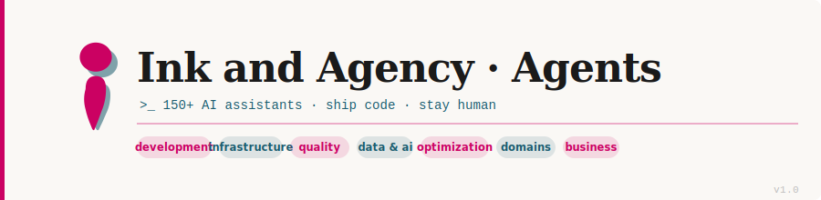

# Ink and Agency · Agents Collection

A curated library of 150+ specialized AI assistants for Claude Code, organized across 10 domains with consistent governance, clear discovery, and automated validation.



## Quick Start

**Ship code. Stay human.**

1. **New to this collection?** Start with [Choosing an Agent](#quick-selection-guide)
2. **Want to add an agent?** See [CLAUDE.md](CLAUDE.md) for contribution workflow
3. **Need architectural decisions?** Check [docs/adr/](docs/adr/) for ADRs
4. **Learning the vocabulary?** Read [CONTEXT.md](CONTEXT.md)

---

## Quick Selection Guide

| Category | Count | Use When | Examples |
|----------|-------|----------|----------|
| **[01 Core Development](#01-core-development)** | 11 | Building apps from scratch—full-stack, backend, frontend, mobile, desktop, APIs | backend-developer, frontend-developer, microservices-architect |
| **[02 Language Specialists](#02-language-specialists)** | 34 | You need language/framework expertise—Python, TypeScript, Go, Java, Rust, etc. | python-pro, typescript-pro, java-architect |
| **[03 Infrastructure](#03-infrastructure)** | 16 | Running systems—DevOps, cloud, Kubernetes, databases, networking, security ops | devops-engineer, kubernetes-specialist, terraform-engineer |
| **[04 Quality & Security](#04-quality--security)** | 18 | Quality gates—testing, code review, security auditing, compliance, performance | code-reviewer, security-auditor, qa-expert |
| **[05 Data & AI](#05-data--ai)** | 13 | Data-driven work—data engineering, ML, AI, analytics, optimization | data-engineer, ai-engineer, data-scientist |
| **[06 Developer Experience](#06-developer-experience)** | 14 | Developer productivity—tooling, build, CLI, docs, DX, MCP, refactoring | documentation-engineer, build-engineer, mcp-developer |
| **[07 Specialized Domains](#07-specialized-domains)** | 15 | Vertical expertise—blockchain, IoT, fintech, gaming, healthcare | blockchain-developer, iot-engineer, fintech-engineer |
| **[08 Business & Product](#08-business--product)** | 16 | Business & delivery—product, project management, business analysis, sales, legal, scrum | product-manager, scrum-master, business-analyst |
| **[09 Meta-Orchestration](#09-meta-orchestration)** | 11 | Agent coordination—multi-agent workflows, state management, orchestration | multi-agent-coordinator, workflow-orchestrator |
| **[10 Research & Analysis](#10-research--analysis)** | 12 | Discovery & insights—research, data analysis, trends, academic literature | research-analyst, trend-analyst, scientific-literature-researcher |

**→ Total: 150 agents** ready to use in Claude Code

---

## What's the Ink and Agency Approach?

This collection reflects a philosophy: **ship code and stay human**. Each agent is designed with clarity, consistency, and autonomy in mind:

- **Clear governance** — Architectural Decision Records (ADRs) document *why* the collection is organized the way it is
- **Consistent taxonomy** — 10 domains based on real-world work patterns, not framework features
- **Automated validation** — Every agent is checked for consistency, proper tools, and governance alignment
- **Your domain language** — [CONTEXT.md](CONTEXT.md) defines the vocabulary so agents share mental models with you
- **Progressive disclosure** — Each agent readme reveals depth without overwhelm
- **Composable with Skills** — Agents integrate with the [Ink and Agency Skill Pack](../skills/README.md) for focused capabilities

The collection is built to work directly with Claude Code, but the structure adapts cleanly to other agent systems. Folder layout, naming conventions, and governance patterns are deliberately portable.

---

## Agents + Skills: Working Together

This agent collection works alongside the **[Ink and Agency Skill Pack](../skills/README.md)**—a complementary library of focused prompt extensions.

### What's the Difference?

| | Agent | Skill |
| --- | --- | --- |
| **Scope** | Deep domain specialist | Focused capability |
| **Lifetime** | Long-running, persistent | One-off or repetitive |
| **Examples** | backend-developer, security-auditor | code-review, writing-humanize |
| **Use when** | You need complete ownership of a domain | You need a quick, structured technique |

### Common Patterns

**Pattern 1: Agent + Skill Enhancement**  
An agent invokes a skill during its workflow to boost quality:

```
Backend developer agent → implements API → code-review skill → validated schema
```

**Pattern 2: Skill → Agent Escalation**  
A skill recognizes deeper work is needed and recommends an agent:

```
Writing-humanize skill → AI patterns removed → suggests content-quality-editor agent
```

**Pattern 3: Composition**  
Complex workflows chain multiple agents and skills:

```
Fullstack developer agent 
  → backend-developer agent 
  → code-review skill 
  → frontend-developer agent 
  → code-review skill
```

### Finding Related Agents & Skills

Each agent can declare related skills in its frontmatter. Look for the `related-skills` field:

```yaml
related-skills:
  - code-review
  - architecture-review
```

For complete integration details, see **[INTEGRATION.md](INTEGRATION.md)**.

---

## 01 Core Development

Core Development subagents are your essential toolkit for building modern applications from the ground up. These specialized agents cover the entire development spectrum—from backend services to frontend interfaces, from mobile apps to desktop applications, and from simple APIs to complex distributed systems.

### When to Use
- **Build new applications** from scratch with proper architecture
- **Implement complex features** that require deep technical expertise
- **Design scalable systems** that can grow with your needs
- **Create beautiful UIs** that provide exceptional user experiences
- **Develop real-time features** for interactive applications
- **Modernize legacy systems** with current best practices

### Available Agents

- **[api-designer](01-core-development/api-designer.md)** — REST and GraphQL API architect. Expert in RESTful principles, GraphQL schemas, API versioning, and documentation. Ensures your APIs are developer-friendly and future-proof.

- **[backend-developer](01-core-development/backend-developer.md)** — Server-side expert for scalable APIs. Your go-to specialist for building robust server applications, RESTful APIs, and microservices. Excels at database design, authentication systems, and performance optimization.

- **[design-bridge](01-core-development/design-bridge.md)** — Design system to code bridge. Translates design specifications into production-ready UI code with pixel-perfect fidelity and design system adherence.

- **[electron-pro](01-core-development/electron-pro.md)** — Desktop app specialist. Builds Electron applications with native OS integration, cross-platform distribution, security hardening, and signed installers.

- **[frontend-developer](01-core-development/frontend-developer.md)** — Multi-framework frontend expert. Specializes in React, Vue, and Angular with state management, component architecture, and performance optimization.

- **[fullstack-developer](01-core-development/fullstack-developer.md)** — Complete feature ownership. Builds entire features spanning database, API, and frontend layers as cohesive units.

- **[graphql-architect](01-core-development/graphql-architect.md)** — GraphQL expert for distributed systems. Designs GraphQL schemas across microservices, implements federation architectures, and optimizes query performance.

- **[microservices-architect](01-core-development/microservices-architect.md)** — Distributed systems designer. Decomposes monolithic applications into independent microservices with scalable communication patterns.

- **[mobile-developer](01-core-development/mobile-developer.md)** — Cross-platform mobile specialist. Builds React Native and Flutter applications with native performance, platform-specific features, and 80%+ code sharing.

- **[ui-designer](01-core-development/ui-designer.md)** — Visual design expert. Creates beautiful interfaces, design systems, component libraries with exceptional UX and accessibility.

- **[websocket-engineer](01-core-development/websocket-engineer.md)** — Real-time communication expert. Implements WebSocket and Socket.IO solutions at scale with low-latency, bidirectional updates.

---

## 02 Language Specialists

Language Specialists bring deep expertise in specific programming languages and frameworks. Use these when you need language-specific patterns, idioms, performance optimization, or framework mastery.

### When to Use
- **Language-specific problems** requiring idiomatic solutions
- **Framework expertise** for complex architectural patterns
- **Performance optimization** using language-native features
- **Modern versions** (e.g., Python 3.11+, TypeScript 5+, Go 1.21+)
- **Best practices** for your chosen tech stack

### Available Agents

- **[angular-architect](02-language-specialists/angular-architect.md)** — Enterprise Angular expert. Designs complex Angular 15+ applications with state management, RxJS patterns, micro-frontend systems, and performance optimization.

- **[ansible-expert](02-language-specialists/ansible-expert.md)** — Ansible automation specialist. Builds infrastructure automation, configuration management, and orchestration with idiomatic playbooks, roles, and modules.

- **[cpp-pro](02-language-specialists/cpp-pro.md)** — Modern C++ specialist. Leverages C++20/23 features, template metaprogramming, and zero-overhead abstractions for high-performance systems programming.

- **[csharp-developer](02-language-specialists/csharp-developer.md)** — C# and .NET expert. Builds ASP.NET Core APIs, cloud-native .NET solutions with async patterns, dependency injection, and Entity Framework optimization.

- **[django-developer](02-language-specialists/django-developer.md)** — Django web framework expert. Builds Django 4+ web applications, REST APIs, and modernizes existing projects with async views.

- **[dotnet-core-expert](02-language-specialists/dotnet-core-expert.md)** — .NET Core specialist. Builds cloud-native microservices and high-performance applications with modern C# patterns and cross-platform deployment.

- **[dotnet-framework-4.8-expert](02-language-specialists/dotnet-framework-4.8-expert.md)** — Legacy .NET Framework specialist. Maintains and modernizes .NET Framework 4.8 enterprise applications with Windows infrastructure integration.

- **[elixir-expert](02-language-specialists/elixir-expert.md)** — Elixir and OTP specialist. Builds fault-tolerant, concurrent systems leveraging OTP patterns, GenServer architectures, and Phoenix framework.

- **[expo-react-native-expert](02-language-specialists/expo-react-native-expert.md)** — React Native and Expo expert. Builds mobile applications with native module integration, navigation, animations, push notifications, and OTA updates.

- **[fastapi-developer](02-language-specialists/fastapi-developer.md)** — FastAPI specialist. Builds modern async Python APIs with Pydantic v2 validation, dependency injection, and high-performance ASGI deployment.

- **[flutter-expert](02-language-specialists/flutter-expert.md)** — Flutter specialist. Builds cross-platform mobile apps (iOS, Android, Web) with custom UI, complex state management, and native platform integrations.

- **[golang-pro](02-language-specialists/golang-pro.md)** — Go specialist. Builds concurrent, high-performance systems and microservices with idiomatic Go patterns and cloud-native architectures.

- **[gradle-expert](02-language-specialists/gradle-expert.md)** — Gradle build expert. Configures Gradle 7+/8+ projects, optimizes build performance, manages dependencies, and implements multi-module architectures.

- **[java-architect](02-language-specialists/java-architect.md)** — Enterprise Java specialist. Designs Java architectures, migrates Spring Boot applications, and establishes microservices patterns for cloud-native systems.

- **[javascript-pro](02-language-specialists/javascript-pro.md)** — JavaScript specialist. Builds modern JavaScript (ES2024+) applications with advanced async patterns, testing, and performance optimization.

- **[kotlin-specialist](02-language-specialists/kotlin-specialist.md)** — Kotlin specialist. Leverages Kotlin on the JVM, Android, and multiplatform projects with idiomatic patterns and null-safety excellence.

- **[laravel-specialist](02-language-specialists/laravel-specialist.md)** — Laravel web framework expert. Builds Laravel 10+ applications with Eloquent ORM, real-time features, and API design.

- **[nextjs-developer](02-language-specialists/nextjs-developer.md)** — Next.js specialist. Builds full-stack React applications with server-side rendering, API routes, optimization, and deployment.

- **[node-specialist](02-language-specialists/node-specialist.md)** — Node.js specialist. Builds scalable backend applications, CLIs, and real-time systems with Node.js 18+ and npm ecosystem expertise.

- **[php-pro](02-language-specialists/php-pro.md)** — Modern PHP specialist. Builds clean PHP 8+ applications with modern frameworks, async support, and best practices.

- **[powershell-5.1-expert](02-language-specialists/powershell-5.1-expert.md)** — PowerShell 5.1 expert. Automates Windows systems administration and scripting with legacy PowerShell.

- **[powershell-7-expert](02-language-specialists/powershell-7-expert.md)** — PowerShell 7 specialist. Automates systems administration and cross-platform scripting with modern PowerShell 7+.

- **[python-pro](02-language-specialists/python-pro.md)** — Python specialist. Builds type-safe, production-ready Python 3.11+ code for web APIs, system utilities, and complex applications with modern async patterns.

- **[rails-expert](02-language-specialists/rails-expert.md)** — Ruby on Rails expert. Builds Rails 7+ applications with Active Record, background jobs, real-time features, and deployment.

- **[react-specialist](02-language-specialists/react-specialist.md)** — React expert. Builds modern React 18+ applications with hooks, state management, performance optimization, and testing.

- **[rust-engineer](02-language-specialists/rust-engineer.md)** — Rust engineer. Builds high-performance, memory-safe systems with Rust's type system, ownership model, and ecosystem.

- **[shell-expert](02-language-specialists/shell-expert.md)** — Shell scripting expert. Writes bash/zsh scripts for system automation, deployment, and DevOps workflows.

- **[spring-boot-engineer](02-language-specialists/spring-boot-engineer.md)** — Spring Boot specialist. Builds production-ready Spring Boot applications with dependency injection, data access, and cloud deployment.

- **[sql-pro](02-language-specialists/sql-pro.md)** — SQL and database expert. Optimizes queries, designs schemas, and manages databases across SQL Server, PostgreSQL, MySQL, and Oracle.

- **[swift-expert](02-language-specialists/swift-expert.md)** — Swift specialist. Builds iOS/macOS applications with SwiftUI, concurrency patterns, and native performance.

- **[symfony-specialist](02-language-specialists/symfony-specialist.md)** — Symfony web framework expert. Builds Symfony 6+ applications with components, bundles, and enterprise patterns.

- **[typescript-pro](02-language-specialists/typescript-pro.md)** — TypeScript specialist. Builds type-safe JavaScript applications with advanced TypeScript patterns, generics, and strict mode.

- **[vue-expert](02-language-specialists/vue-expert.md)** — Vue specialist. Builds Vue 3 applications with Composition API, state management, and full-stack integration.

---

## 03 Infrastructure

Infrastructure agents handle running systems—DevOps, cloud platforms, container orchestration, databases, networking, and operations security. Use these when deploying, scaling, and maintaining production infrastructure.

### When to Use
- **Deployment & scaling** of applications across cloud or on-premise infrastructure
- **Infrastructure as Code** with Terraform, CloudFormation, Ansible
- **Container orchestration** with Docker, Kubernetes, or container registries
- **Database administration** and optimization
- **Networking & security** for production systems
- **CI/CD automation** and deployment pipelines

### Available Agents

- **[azure-infra-engineer](03-infrastructure/azure-infra-engineer.md)** — Azure infrastructure specialist. Deploys and manages Azure resources with Infrastructure as Code, cloud-native services, and enterprise patterns.

- **[cloud-architect](03-infrastructure/cloud-architect.md)** — Cloud architecture designer. Designs scalable, secure, cost-effective cloud infrastructure across AWS, Azure, GCP with multi-cloud patterns.

- **[database-administrator](03-infrastructure/database-administrator.md)** — Database specialist. Manages databases (SQL Server, PostgreSQL, MySQL, Oracle) with optimization, backup, and high-availability strategies.

- **[deployment-engineer](03-infrastructure/deployment-engineer.md)** — Deployment automation expert. Builds deployment pipelines, manages releases, and ensures smooth production rollouts.

- **[devops-engineer](03-infrastructure/devops-engineer.md)** — DevOps specialist. Builds and optimizes infrastructure automation, CI/CD pipelines, containerization, and deployment workflows.

- **[devops-incident-responder](03-infrastructure/devops-incident-responder.md)** — Incident response specialist. Responds to production incidents, diagnoses issues, and implements post-incident improvements.

- **[docker-expert](03-infrastructure/docker-expert.md)** — Docker specialist. Builds optimized Docker images, manages registries, and containerizes applications.

- **[incident-responder](03-infrastructure/incident-responder.md)** — Incident management expert. Manages incident response workflows, communication, remediation, and post-mortems.

- **[kubernetes-specialist](03-infrastructure/kubernetes-specialist.md)** — Kubernetes expert. Deploys, manages, and optimizes Kubernetes clusters with scaling, monitoring, and security.

- **[network-engineer](03-infrastructure/network-engineer.md)** — Network infrastructure expert. Designs and manages networks, security groups, VPCs, load balancing, and connectivity.

- **[platform-engineer](03-infrastructure/platform-engineer.md)** — Platform engineering specialist. Builds internal developer platforms, abstractions, and self-service infrastructure.

- **[security-engineer](03-infrastructure/security-engineer.md)** — Security infrastructure specialist. Implements infrastructure security, compliance, secrets management, and threat prevention.

- **[sre-engineer](03-infrastructure/sre-engineer.md)** — Site Reliability Engineer. Builds reliable systems with monitoring, alerting, incident response, and capacity planning.

- **[terraform-engineer](03-infrastructure/terraform-engineer.md)** — Terraform specialist. Builds Infrastructure as Code with Terraform, manages state, and implements modular designs.

- **[terragrunt-expert](03-infrastructure/terragrunt-expert.md)** — Terragrunt specialist. Manages Terraform configurations at scale with DRY patterns, composition, and multi-environment deployments.

- **[windows-infra-admin](03-infrastructure/windows-infra-admin.md)** — Windows infrastructure specialist. Administers Windows Server environments, Active Directory, and enterprise infrastructure.

---

## 04 Quality & Security

Quality & Security agents ensure code meets standards, security is hardened, performance is optimized, and compliance is achieved. Use these for testing, code review, security auditing, and quality gates.

### When to Use
- **Code review** and quality assurance before merging
- **Security auditing** and vulnerability scanning
- **Automated testing** implementation and coverage expansion
- **Compliance & regulatory** requirements (GDPR, HIPAA, SOC 2, etc.)
- **Performance engineering** and optimization
- **Accessibility testing** and standards compliance

### Available Agents

- **[accessibility-tester](04-quality-security/accessibility-tester.md)** — Accessibility expert. Tests for WCAG compliance, ensures keyboard navigation, screen reader support, and inclusive design.

- **[ad-security-reviewer](04-quality-security/ad-security-reviewer.md)** — Active Directory security specialist. Reviews AD configurations, permissions, and security posture.

- **[ai-writing-auditor](04-quality-security/ai-writing-auditor.md)** — AI content auditor. Detects AI-generated writing patterns and ensures authentic, human-quality content.

- **[architect-reviewer](04-quality-security/architect-reviewer.md)** — Architecture reviewer. Reviews system design for scalability, maintainability, consistency with architectural decisions, and long-term viability.

- **[chaos-engineer](04-quality-security/chaos-engineer.md)** — Chaos engineering specialist. Designs and runs chaos experiments to test resilience, failure modes, and recovery procedures.

- **[code-reviewer](04-quality-security/code-reviewer.md)** — Senior code reviewer. Provides comprehensive code review focusing on quality, security, best practices, and optimization.

- **[compliance-auditor](04-quality-security/compliance-auditor.md)** — Compliance specialist. Audits systems for regulatory compliance (SOC 2, ISO 27001, HIPAA, GDPR, etc.).

- **[debugger](04-quality-security/debugger.md)** — Debugging specialist. Diagnoses hard-to-find bugs using systematic investigation, logging analysis, and root cause analysis.

- **[error-detective](04-quality-security/error-detective.md)** — Error analysis specialist. Investigates error messages, stack traces, and logs to identify root causes and solutions.

- **[gdpr-ccpa-compliance](04-quality-security/gdpr-ccpa-compliance.md)** — GDPR & CCPA expert. Ensures compliance with data privacy regulations, consent management, and user rights.

- **[penetration-tester](04-quality-security/penetration-tester.md)** — Penetration testing specialist. Conducts authorized security testing, identifies vulnerabilities, and documents findings.

- **[performance-engineer](04-quality-security/performance-engineer.md)** — Performance optimization expert. Profiles applications, identifies bottlenecks, and optimizes for speed and efficiency.

- **[powershell-security-hardening](04-quality-security/powershell-security-hardening.md)** — PowerShell security specialist. Hardens PowerShell configurations and scripts against injection and execution policy bypasses.

- **[qa-expert](04-quality-security/qa-expert.md)** — QA & testing specialist. Designs test strategies, implements automated testing, and ensures comprehensive coverage.

- **[security-auditor](04-quality-security/security-auditor.md)** — Security audit specialist. Conducts comprehensive security audits of code, infrastructure, and systems.

- **[test-automator](04-quality-security/test-automator.md)** — Test automation expert. Builds automated test suites, implements CI/CD testing, and optimizes test execution.

- **[ui-ux-tester](04-quality-security/ui-ux-tester.md)** — UI/UX testing specialist. Tests user interfaces for usability, consistency, and user satisfaction.

---

## 05 Data & AI

Data & AI agents bring expertise in data engineering, machine learning, AI model development, analytics, and optimization. Use these when building data pipelines, ML models, or analytics infrastructure.

### When to Use
- **Data engineering** pipelines and ETL workflows
- **Machine learning** model development and training
- **AI applications** using LLMs and generative AI
- **Data analysis** and business intelligence
- **Optimization** of algorithms and data structures

### Available Agents

- **[ai-engineer](05-data-ai/ai-engineer.md)** — AI specialist. Develops AI applications leveraging LLMs, embeddings, prompt engineering, and generative AI patterns.

- **[data-analyst](05-data-ai/data-analyst.md)** — Data analysis expert. Analyzes data, creates visualizations, and derives actionable business insights.

- **[data-engineer](05-data-ai/data-engineer.md)** — Data engineering specialist. Builds data pipelines, ETL workflows, and data warehouse infrastructure.

- **[data-scientist](05-data-ai/data-scientist.md)** — Data science expert. Develops machine learning models, statistical analysis, and predictive algorithms.

- **[database-optimizer](05-data-ai/database-optimizer.md)** — Database optimization expert. Optimizes database performance through indexing, query optimization, and schema design.

*(Additional data & AI agents available—see [05-data-ai/README.md](05-data-ai/README.md))*

---

## 06 Developer Experience

Developer Experience agents focus on improving developer productivity—tooling, build systems, documentation, CLI development, MCP servers, and refactoring. Use these to enhance DX across your organization.

### When to Use
- **Build system** optimization and modernization
- **Developer tooling** and CLI applications
- **Documentation** writing and generation
- **Code refactoring** and modernization
- **MCP server** development for Claude integration
- **Dependency management** and version optimization

### Available Agents

- **[build-engineer](06-developer-experience/build-engineer.md)** — Build system specialist. Optimizes build systems, manages dependencies, and implements efficient build automation.

- **[cli-developer](06-developer-experience/cli-developer.md)** — CLI application expert. Builds command-line interfaces with excellent UX, shell integration, and cross-platform support.

- **[dependency-manager](06-developer-experience/dependency-manager.md)** — Dependency management specialist. Manages project dependencies, updates, vulnerabilities, and compatibility.

- **[documentation-engineer](06-developer-experience/documentation-engineer.md)** — Documentation specialist. Writes comprehensive, clear technical documentation and API references.

- **[dx-optimizer](06-developer-experience/dx-optimizer.md)** — Developer experience expert. Optimizes development workflows, tooling, and team productivity.

- **[git-workflow-manager](06-developer-experience/git-workflow-manager.md)** — Git workflow specialist. Establishes and manages Git workflows, branching strategies, and best practices.

- **[legacy-modernizer](06-developer-experience/legacy-modernizer.md)** — Legacy code specialist. Modernizes legacy codebases with incremental refactoring and migration strategies.

- **[mcp-developer](06-developer-experience/mcp-developer.md)** — MCP server specialist. Develops Model Context Protocol servers for Claude integration and automation.

- **[powershell-module-architect](06-developer-experience/powershell-module-architect.md)** — PowerShell module expert. Builds PowerShell modules with proper structure, documentation, and publishing.

- **[powershell-ui-architect](06-developer-experience/powershell-ui-architect.md)** — PowerShell UI specialist. Builds interactive PowerShell scripts with menus, forms, and rich terminal UIs.

- **[readme-generator](06-developer-experience/readme-generator.md)** — README specialist. Generates clear, comprehensive README files that help users get started quickly.

- **[refactoring-specialist](06-developer-experience/refactoring-specialist.md)** — Refactoring expert. Refactors code for clarity, performance, maintainability, and architectural improvement.

- **[slack-expert](06-developer-experience/slack-expert.md)** — Slack integration specialist. Builds Slack bots, apps, and integrations for team communication and automation.

- **[tooling-engineer](06-developer-experience/tooling-engineer.md)** — Developer tools architect. Builds developer tools, utilities, and infrastructure improving team productivity.

- **[visual-asset-generator](06-developer-experience/visual-asset-generator.md)** — Visual asset specialist. Generates diagrams, images, icons, and visual documentation.

---

## 07 Specialized Domains

Specialized Domains agents bring expertise in vertical-specific technologies—blockchain, IoT, fintech, gaming, healthcare, and other niches. Use these when building in specialized verticals.

### When to Use
- **Blockchain & crypto** applications and smart contracts
- **IoT & embedded** systems and connected devices
- **Fintech & payments** platforms and integration
- **Gaming** development and game engines
- **Healthcare & HIPAA** compliance applications
- **Industry-specific** technology requirements

### Available Agents

- **[api-documenter](07-specialized-domains/api-documenter.md)** — API documentation specialist. Creates comprehensive API documentation with examples and integrations.

- **[blockchain-developer](07-specialized-domains/blockchain-developer.md)** — Blockchain specialist. Develops smart contracts, dApps, and blockchain applications.

- **[embedded-systems](07-specialized-domains/embedded-systems.md)** — Embedded systems specialist. Develops firmware, embedded software, and hardware integration.

- **[fintech-engineer](07-specialized-domains/fintech-engineer.md)** — Fintech specialist. Builds financial applications with compliance, security, and payment integration.

- **[game-developer](07-specialized-domains/game-developer.md)** — Game development specialist. Develops games with game engines, physics, graphics, and gameplay systems.

- **[healthcare-admin](07-specialized-domains/healthcare-admin.md)** — Healthcare IT specialist. Manages healthcare infrastructure and compliance.

- **[hipaa-compliance](07-specialized-domains/hipaa-compliance.md)** — HIPAA compliance expert. Ensures healthcare applications meet HIPAA requirements and security standards.

- **[iot-engineer](07-specialized-domains/iot-engineer.md)** — IoT specialist. Develops IoT applications, device management, and sensor integration.

- **[m365-admin](07-specialized-domains/m365-admin.md)** — Microsoft 365 specialist. Administers M365 services, Teams, SharePoint, and enterprise collaboration.

- **[mobile-app-developer](07-specialized-domains/mobile-app-developer.md)** — Mobile app specialist. Develops mobile applications (iOS, Android) with platform-specific expertise.

- **[payment-integration](07-specialized-domains/payment-integration.md)** — Payment integration specialist. Integrates payment gateways, fraud detection, and financial workflows.

- **[quant-analyst](07-specialized-domains/quant-analyst.md)** — Quantitative analysis specialist. Develops quantitative models and algorithmic trading systems.

- **[risk-manager](07-specialized-domains/risk-manager.md)** — Risk management specialist. Develops risk assessment and mitigation strategies.

- **[seo-specialist](07-specialized-domains/seo-specialist.md)** — SEO optimization specialist. Optimizes websites and content for search engine visibility.

*(Additional specialized domain agents available—see [07-specialized-domains/README.md](07-specialized-domains/README.md))*

---

## 08 Business & Product

Business & Product agents focus on business strategy, product management, project delivery, and organizational effectiveness. Use these for product development, project management, and business analysis.

### When to Use
- **Product strategy** and roadmap planning
- **Project management** and delivery
- **Business analysis** and requirements definition
- **Agile & scrum** process facilitation
- **Sales & business development**
- **Legal & compliance** business matters

### Available Agents

- **[assumption-mapping](08-business-product/assumption-mapping.md)** — Assumption analysis specialist. Identifies, validates, and tests business assumptions.

- **[backlog-grooming](08-business-product/backlog-grooming.md)** — Backlog management specialist. Prepares and prioritizes product backlog for sprint planning.

- **[business-analyst](08-business-product/business-analyst.md)** — Business analysis expert. Analyzes business needs and translates to technical requirements.

- **[content-quality-editor](08-business-product/content-quality-editor.md)** — Content quality specialist. Edits and improves content for clarity, consistency, and quality.

- **[customer-success-manager](08-business-product/customer-success-manager.md)** — Customer success specialist. Manages customer relationships and ensures customer value realization.

- **[growth-loops](08-business-product/growth-loops.md)** — Growth strategy specialist. Designs and implements growth loops and viral mechanics.

- **[legal-advisor](08-business-product/legal-advisor.md)** — Legal consulting specialist. Provides business legal advice on contracts, compliance, and disputes.

- **[license-engineer](08-business-product/license-engineer.md)** — Software licensing specialist. Manages software licenses, compliance, and legal obligations.

- **[product-manager](08-business-product/product-manager.md)** — Product management expert. Manages product strategy, roadmap, and delivery.

- **[project-manager](08-business-product/project-manager.md)** — Project management specialist. Manages projects, timelines, budgets, and stakeholder communication.

- **[sales-engineer](08-business-product/sales-engineer.md)** — Sales engineering specialist. Supports sales with technical expertise and solution architecture.

- **[scrum-master](08-business-product/scrum-master.md)** — Scrum facilitation expert. Facilitates Scrum ceremonies, removes impediments, and optimizes team velocity.

- **[wordpress-master](08-business-product/wordpress-master.md)** — WordPress specialist. Builds and manages WordPress sites with themes, plugins, and e-commerce.

*(Additional business & product agents available—see [08-business-product/README.md](08-business-product/README.md))*

---

## 09 Meta-Orchestration

Meta-Orchestration agents coordinate and orchestrate other agents—workflow management, multi-agent coordination, state management, and distributed task execution. Use these when automating complex workflows across teams or systems.

### When to Use
- **Multi-agent workflows** requiring coordination
- **Task distribution** across specialized agents
- **State management** and context sharing between agents
- **Error coordination** and failure recovery
- **Knowledge synthesis** from multiple experts
- **Workflow orchestration** and process automation

### Available Agents

- **[agent-installer](09-meta-orchestration/agent-installer.md)** — Agent installation specialist. Installs, configures, and manages agent deployments.

- **[agent-organizer](09-meta-orchestration/agent-organizer.md)** — Agent organization specialist. Organizes and categorizes agents for discovery and usage.

- **[codebase-orchestrator](09-meta-orchestration/codebase-orchestrator.md)** — Codebase orchestration specialist. Orchestrates code exploration, analysis, and modification across large codebases.

- **[context-manager](09-meta-orchestration/context-manager.md)** — Context management specialist. Manages context sharing and state between agents.

- **[error-coordinator](09-meta-orchestration/error-coordinator.md)** — Error handling specialist. Coordinates error resolution across multiple agents.

- **[it-ops-orchestrator](09-meta-orchestration/it-ops-orchestrator.md)** — IT operations orchestration specialist. Orchestrates IT operations workflows and infrastructure tasks.

- **[knowledge-synthesizer](09-meta-orchestration/knowledge-synthesizer.md)** — Knowledge synthesis specialist. Synthesizes insights from multiple expert agents.

- **[multi-agent-coordinator](09-meta-orchestration/multi-agent-coordinator.md)** — Multi-agent coordination expert. Coordinates complex multi-agent workflows with proper sequencing and dependency management.

- **[performance-monitor](09-meta-orchestration/performance-monitor.md)** — Performance monitoring specialist. Monitors agent performance, resource usage, and optimization opportunities.

- **[task-distributor](09-meta-orchestration/task-distributor.md)** — Task distribution specialist. Distributes tasks across agents based on capabilities and availability.

- **[workflow-orchestrator](09-meta-orchestration/workflow-orchestrator.md)** — Workflow orchestration expert. Orchestrates complex workflows with proper error handling, state management, and recovery.

---

## 10 Research & Analysis

Research & Analysis agents bring expertise in research methodology, data analysis, trend analysis, and academic literature. Use these for discovery, insights, and research-driven decision making.

### When to Use
- **Research & discovery** of new information or markets
- **Data analysis** and insights extraction
- **Trend analysis** and market forecasting
- **Academic research** and literature review
- **Competitive analysis** and benchmarking
- **Specialist search** for obscure information

### Available Agents

- **[research-analyst](10-research-analysis/research-analyst.md)** — Research analysis expert. Conducts research, analysis, and insight generation on complex topics.

- **[scientific-literature-researcher](10-research-analysis/scientific-literature-researcher.md)** — Academic research specialist. Conducts systematic literature reviews and academic research.

- **[search-specialist](10-research-analysis/search-specialist.md)** — Search optimization specialist. Optimizes searches to find relevant information quickly and accurately.

- **[trend-analyst](10-research-analysis/trend-analyst.md)** — Trend analysis specialist. Analyzes trends, forecasts, and emerging patterns in markets and technology.

*(Additional research & analysis agents available—see [10-research-analysis/README.md](10-research-analysis/README.md))*

---

## How to Choose an Agent

1. **Identify your task** — What do you need to accomplish?
2. **Find the right category** — Use the Quick Selection Guide above
3. **Pick your agent** — Review agent descriptions for the best fit
4. **Check the agent README** — Each category folder has detailed guidance
5. **Invoke the agent** — Use Claude Code's agent selection UI or reference the agent name

**Still unsure?** Read the [agent's full description](01-core-development/README.md) or check [CONTEXT.md](CONTEXT.md) for terminology help.

---

## Contributing a New Agent

To add a new agent to this collection:

1. **Review [CLAUDE.md](CLAUDE.md)** for the contribution workflow
2. **Choose the right category** — Use ADR-0001 decision tree
3. **Create the agent file** — Follow YAML frontmatter standards (see ADR-0004)
4. **Add to category README** — Link from the appropriate `XX-category/README.md`
5. **Run linting** — Validate with `scripts/lint-agents.ps1`
6. **Submit for review** — Include ADR references if new category/policies

---

## Architecture & Governance

This collection is governed by a set of Architectural Decision Records (ADRs) and domain vocabulary to ensure consistency and quality:

- **[CONTEXT.md](CONTEXT.md)** — Domain vocabulary and consistency standards
- **[CLAUDE.md](CLAUDE.md)** — Contribution workflow and governance
- **[docs/adr/ADR-0001-category-taxonomy.md](docs/adr/ADR-0001-category-taxonomy.md)** — Why 10 categories; when to add new ones
- **[docs/adr/ADR-0002-model-assignment-policy.md](docs/adr/ADR-0002-model-assignment-policy.md)** — Model selection (haiku/sonnet/opus) by role
- **[docs/adr/ADR-0003-tool-permissions-framework.md](docs/adr/ADR-0003-tool-permissions-framework.md)** — Tool permissions by role type
- **[docs/adr/ADR-0004-frontmatter-invariants.md](docs/adr/ADR-0004-frontmatter-invariants.md)** — YAML validation rules

---

## Validation & Quality Assurance

All agents in this collection are validated for:
- ✅ Consistent YAML frontmatter (required fields, valid values)
- ✅ Alphabetical ordering within categories
- ✅ Unique agent names across the collection
- ✅ Model assignments aligned with ADR policy
- ✅ Tool permissions matching role type
- ✅ Descriptions clear and action-oriented

Run `scripts/lint-agents.ps1` to validate locally.

---

## Support

- **Questions about agents?** Read the agent's full description in its category folder
- **Unsure which agent to use?** Check the Quick Selection Guide or category README
- **Found an issue?** Create an issue or pull request
- **Want to contribute?** See CLAUDE.md for guidelines
- **Need architectural clarity?** Check CONTEXT.md and the ADRs in docs/adr/

---

## About Ink and Agency

This collection is built on principles of clarity, human-centered design, and operational consistency. The visual branding—rose and teal, watercolor effects, and terminal-friendly typography—reflects the idea that powerful tools can be beautiful, and that structure serves the humans who use it.

**Design philosophy:**
- **Opinionated but adaptable** — We've made governance choices so you don't have to, but the structure ports cleanly to other systems
- **Visual + textual clarity** — Banners, color-coded pills, and consistent formatting make navigation faster
- **Progressive depth** — skim the overview, drill into detail only when needed
- **Portable structure** — Same concepts work in Claude, other agents, and plain markdown tools

For project conventions, naming schemes, and architectural principles, see **[CONTEXT.md](CONTEXT.md)** and **[CLAUDE.md](CLAUDE.md)**.

---

**Last Updated:** 2026-06-17  
**Agent Count:** 150  
**Categories:** 10  
**Status:** All agents validated ✓  
**Brand:** Ink and Agency — Ship code. Stay human.
